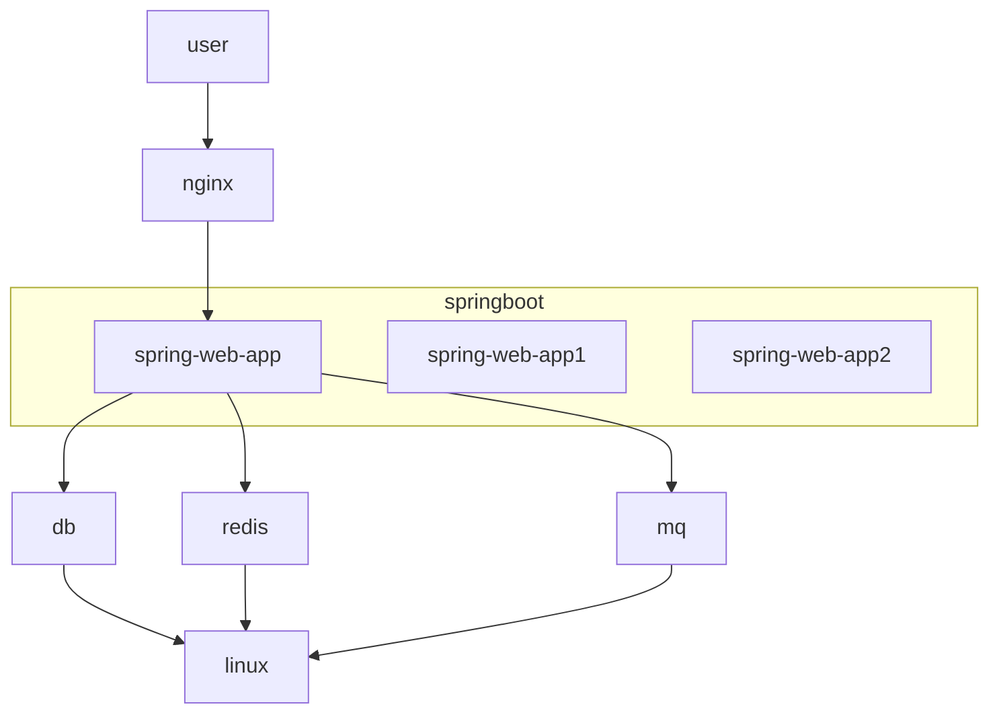
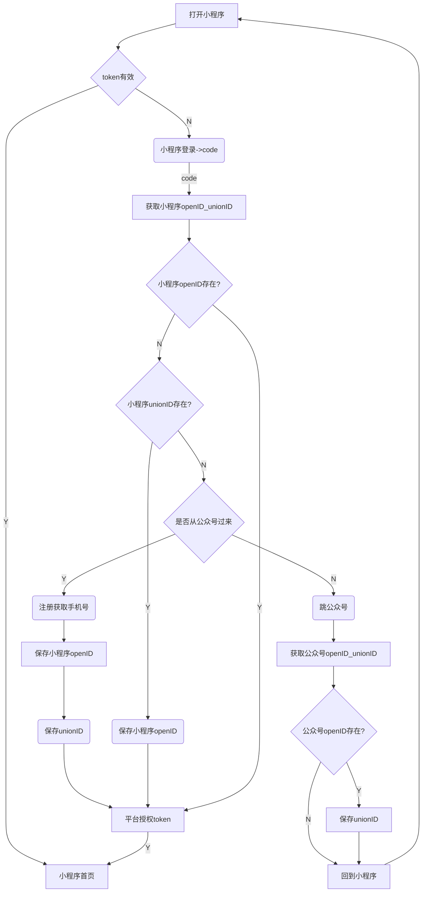
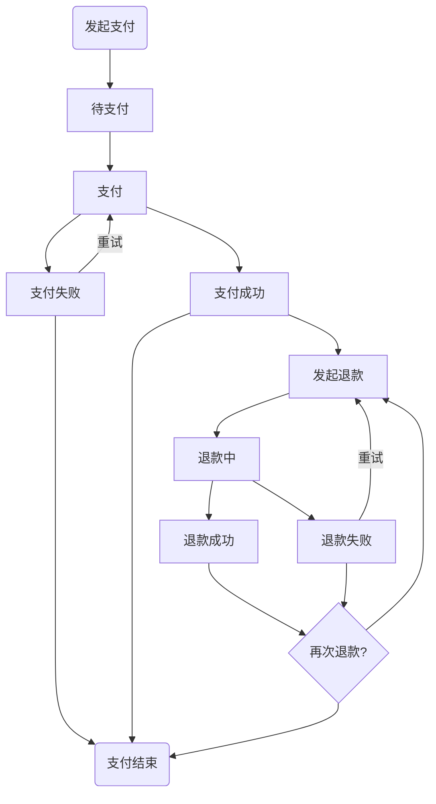

# new

- [代码规范](https://102.alibaba.com/downloadFile.do?file=1528269849853/Java_manual.pdf)

- 项目目录结构

```
├── zsyc-code-generator(代码生成工具)
├── zsyc-common (通用工具)
├── zsyc-framework (框架代码)
├── zsyc-framework-web (web框架代码)
├── zsyc-interface (接口)
├── zsyc-service (服务实现)

```

- 模块目录说明

```
├── sql(数据库脚本)
└── src
    ├── main
    │   ├── java (java代码)
    │   ├── mappers (mybaitis的mapper文件)
    │   ├── resources (properties配置文件)
    │   ├── static-resources
    │   │   ├── static (前端静态文件)
    │   │   └── templates (模板文件)
    │   └── webapp-src (前端源文件)
    └── test
        ├── java (java测试代码)
        └── resources (java测试配置)
```

- 部署说明
    1. springboot
    2. nginx zookeeper redis rabbitmq mysql mongodb
    3. linux jdk8(oracle)
    4. spring-admin
    5. 部署架构图



## oauth

- 整合`spring-security-oauth`,添加`grant_type:account_token`

```bash
curl -X POST \
  https://oauth.ty.gdzsyc.cn:10443/oauth/token \
  -H 'Authorization: Basic dGVzdDp0ZXN0' \
  -d 'grant_type=account_token&account=admin&password=zsyc2019'

```

- 在`controller` 可以通过bean`com.zsyc.api.AccountHelper`获取当用用户
	- 后台使用`AccountHelper#getUser`
	- 小程序端`AccountHelper#getMember`

## docs

1. [表建模](https://www.icloud.com/pages/0b01Tc6--GTKMu59dphWU5lGw#%E8%A1%A8%E5%BB%BA%E6%A8%A1)

## 帐号信息

### 14.29.207.159

#### 服务组件

| server       | port       | username | password | remark | url                                      |
|:-------------|:-----------|:---------|:---------|:-------|:-----------------------------------------|
| zookeeper    | 12181      |          |          |        |                                          |
| dubbo-admin  | 17001      | root     | zsyc2018 |        | https://dubbo-admin.ty.gdzsyc.cn:10443/  |
| spring-admin | 17002      |          |          |        | https://spring-admin.ty.gdzsyc.cn:10443/ |
| mysql        | 8306/13306 | gas      | gas      |        |                                          |
| jenkins      | 8081       | zsyc     | zsyc2018 |        |                                          |
| redis        | 16379      |          | zsyc2018 |        |                                          |


#### 端口

- 9000-10000 业务系统使用

- 10000-20000 服务组件使用

## 测试环境部署

| app   | server                           | port        |
|:------|:---------------------------------|:------------|
| oauth | https://oauth.ty.gdzsyc.cn:10443 | http(9902)  |
| api   | https://api.ty.gdzsyc.cn:10443   | http(9903)  |
| fs    | https://fs.ty.gdzsyc.cn:10443    | http(9904)  |
| img   | https://img.ty.gdzsyc.cn:10443   | dubbo(9901) |


### 192.168.0.107

#### 服务组件

| server           | port  | username | password | remark | url |
|:-----------------|:------|:---------|:---------|:-------|:----|
| zookeeper        | 2181  |          |          |        |     |
| dubbo-admin      | 7001  | root     | zsyc2018 |        |     |
| ~~spring-admin~~ | 17002 |          |          |        |     |
| mysql            | 3306  | gas      | gas      |        |     |
| jenkins          | 8081  | zsyc     | zsyc2018 |        |     |
| redis            | 6379  |          | zsyc2018 |        |     |


#### 端口

- 9000-10000 业务系统使用

- 10000-20000 服务组件使用

## 测试环境部署

| app    | server | port        |
|:-------|:-------|:------------|
| oauth  |        | http(9902)  |
| api    |        | http(9903)  |
| ~~fs~~ |        | http(9904)  |
| img    |        | dubbo(9901) |


## 小程序登录流程




## 支付状态


